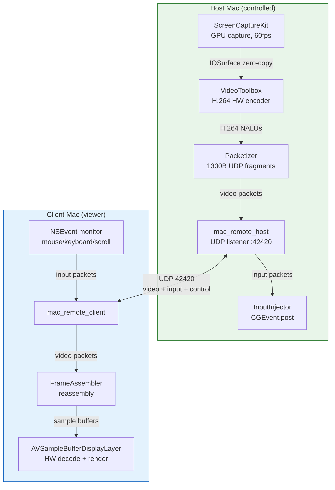
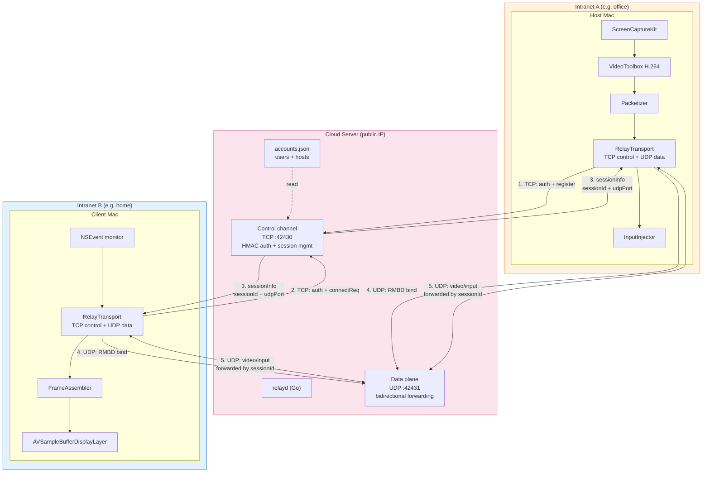
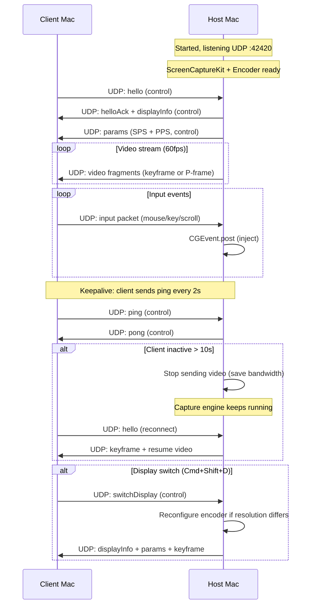
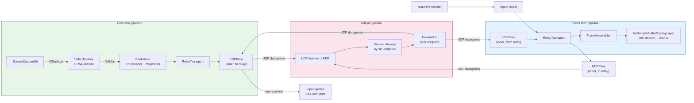
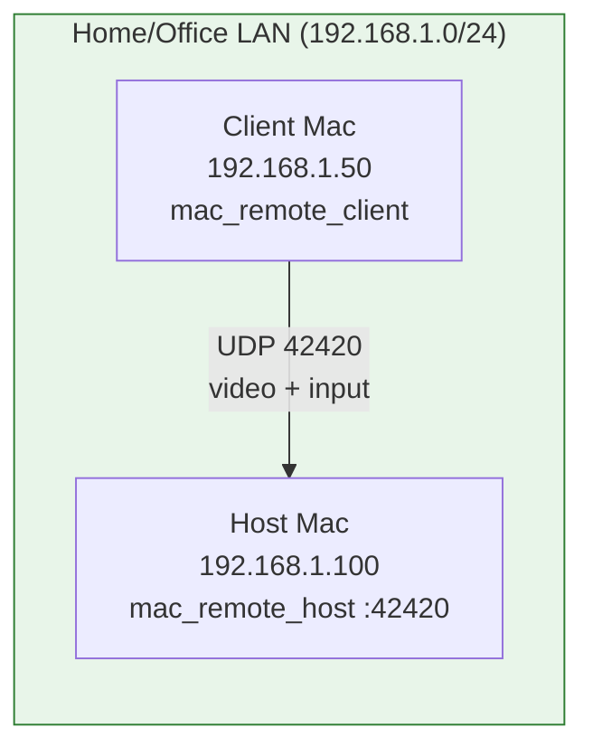
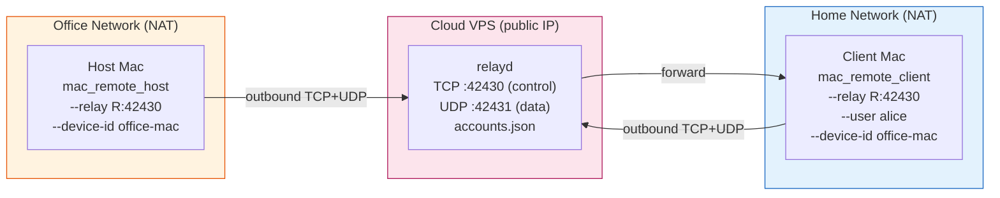
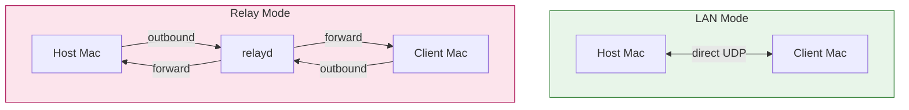

# mac_remote Deployment Guide

This document describes the two deployment modes of `mac_remote` — **LAN mode** (no cloud server) and **Relay mode** (with cloud server) — including architecture diagrams, data-flow sequence diagrams, step-by-step deployment, and usage examples.

---

## Table of Contents

- [Mode Overview](#mode-overview)
- [Architecture Diagrams](#architecture-diagrams)
- [Data Flow Diagrams](#data-flow-diagrams)
- [Mode 1: LAN Deployment (No Cloud Server)](#mode-1-lan-deployment-no-cloud-server)
- [Mode 2: Relay Deployment (With Cloud Server)](#mode-2-relay-deployment-with-cloud-server)
- [Side-by-Side Comparison](#side-by-side-comparison)
- [Troubleshooting](#troubleshooting)

---

## Mode Overview

| Aspect | LAN Mode | Relay Mode |
|--------|----------|------------|
| **Network requirement** | Both Macs on the same LAN/VPN | Macs on any networks (both behind NAT OK) |
| **Cloud server** | Not needed | Required (`relayd`, Go, any Linux VPS) |
| **Connection direction** | Client → Host (client dials host IP) | Both sides → Relay (outbound only) |
| **Transport** | Direct UDP | TCP control + UDP data (via relay) |
| **Authentication** | None (trust the LAN) | HMAC challenge-response (per-user accounts) |
| **Latency** | Lowest (1 hop) | RTT-to-relay × 2 + relay processing |
| **Bandwidth** | LAN bandwidth | Limited by VPS bandwidth |
| **Encryption** | None (LAN-trusted) | None end-to-end (wrap in WireGuard if needed) |
| **Use case** | Same office / home network / VPN | Cross-network, remote office, work-from-home |

---

## Architecture Diagrams

### Mode 1: LAN Mode — Overall Architecture



### Mode 2: Relay Mode — Overall Architecture



---

## Data Flow Diagrams

### LAN Mode — Connection + Data Flow



### Relay Mode — Connection + Auth + Data Flow

```mermaid
sequenceDiagram
    participant H as Host Mac
    participant R as relayd (Cloud)
    participant C as Client Mac

    Note over R: Started, listening TCP :42430 + UDP :42431
    Note over R: accounts.json loaded (users + hosts)

    rect rgb(255, 243, 224)
        Note over H,R: Phase 1: Host registers
        H->>R: TCP connect
        R->>H: challenge (32-byte nonce)
        H->>H: HMAC-SHA256(SHA256(password), nonce)
        H->>R: authHost [device-id, HMAC]
        R->>H: ok
        Note over R: device "office-mac" registered
    end

    rect rgb(227, 242, 253)
        Note over C,R: Phase 2: Client logs in + requests device
        C->>R: TCP connect
        R->>C: challenge (32-byte nonce)
        C->>C: HMAC-SHA256(SHA256(password), nonce)
        C->>R: authUser [username, HMAC]
        R->>C: ok
        C->>R: connectReq [device-id "office-mac"]
    end

    rect rgb(252, 228, 236)
        Note over H,R,C: Phase 3: Session setup
        R->>R: Create session (random 64-bit id)
        R->>H: sessionInfo [sessionId, udpPort 42431]
        R->>C: sessionInfo [sessionId, udpPort 42431]
    end

    rect rgb(232, 245, 233)
        Note over H,R,C: Phase 4: UDP bind
        H->>R: UDP: RMBD + sessionId + side=1 (host)
        C->>R: UDP: RMBD + sessionId + side=2 (client)
        Note over R: Record both endpoints
    end

    rect rgb(243, 229, 245)
        Note over H,R,C: Phase 5: Data relay (existing protocol flows inside)
        loop Video stream
            H->>R: UDP: video fragments
            R->>C: UDP: forward (same bytes)
        end
        loop Input events
            C->>R: UDP: input packets
            R->>H: UDP: forward (same bytes)
            H->>H: CGEvent.post (inject)
        end
        loop Keepalive (every 2s)
            C->>R: UDP: ping
            R->>H: UDP: forward ping
            H->>R: UDP: pong
            R->>C: UDP: forward pong
        end
    end
```

### Relay Mode — Component Data Flow (Internal Pipeline)



---

## Mode 1: LAN Deployment (No Cloud Server)

Use this when both Macs are on the **same local network** (same office, same home, or connected via VPN that routes traffic between them).

### Prerequisites

- Both Macs running macOS 13 (Ventura) or later
- Both Macs on the same LAN (or VPN with routable IPs)
- Xcode (for universal builds) or Command Line Tools (native-arch builds)
- Host Mac: Screen Recording + Accessibility permissions

### Step 1: Build

On either Mac (or a build machine):

```sh
git clone https://github.com/klab-mao/mac_remote.git
cd mac_remote
swift build --arch arm64 --arch x86_64
```

Binaries land in `.build/out/Products/Debug/`:
- `mac_remote_host` — run on the controlled Mac
- `mac_remote_client` — run on the viewing Mac

Copy both binaries to the respective Macs (if built on a different machine).

### Step 2: Grant permissions on the Host Mac

Run the host once from Terminal, then grant:

1. **System Settings → Privacy & Security → Screen Recording** → enable `mac_remote_host` (or Terminal)
2. **System Settings → Privacy & Security → Accessibility** → enable the same

Restart the host and verify:
```
Screen Recording permission: GRANTED
Accessibility permission: GRANTED
```

### Step 3: Start the Host

```sh
# On the Host Mac (the one being controlled):
.build/out/Products/Debug/mac_remote_host --port 42420 --fps 60 --bitrate 40
```

The host listens on UDP 42420 and prints:
```
Available displays: 2
  [0] id=3 2560x1440 origin=(0,0)
  [1] id=1 2560x1440 origin=(2560,0)
Encoder ready: 2560x1440 40Mbps H.264 HW
Listening on UDP 42420
```

### Step 4: Connect from the Client

```sh
# On the Client Mac (the one viewing):
.build/out/Products/Debug/mac_remote_client 192.168.1.100 --port 42420
```

Replace `192.168.1.100` with the host's LAN IP. The client opens a borderless fullscreen window and video begins streaming.

### Step 5: (Optional) Run host as a service

```sh
scripts/install_service.sh --fps 60 --bitrate 40
```

This installs a per-user LaunchAgent that starts at login and auto-restarts on crash. See README for details.

### LAN Mode — Complete Example



---

## Mode 2: Relay Deployment (With Cloud Server)

Use this when the Macs are on **different networks** (e.g. office Mac behind corporate NAT, home Mac behind home router NAT). Both sides connect **outbound** to your cloud server — no port forwarding or router changes needed.

### Prerequisites

- Both Macs: macOS 13+, same build steps as LAN mode
- Cloud server: any Linux VPS with a **public IP**, Go 1.21+
- Cloud server: inbound firewall open for TCP 42430 + UDP 42431

### Step 1: Deploy the relay server

On your cloud server:

```sh
# Build relayd
git clone https://github.com/klab-mao/mac_remote.git
cd mac_remote/relayd
go build -o relayd .

# Create accounts (chmod 600!)
cat > accounts.json << 'EOF'
{
  "users": {
    "alice": "alice-viewer-password",
    "bob": "bob-viewer-password"
  },
  "hosts": {
    "office-mac": "office-host-password",
    "home-mac": "home-host-password"
  }
}
EOF
chmod 600 accounts.json
```

- `users` — accounts for **client** Macs (viewers who log in)
- `hosts` — accounts for **host** Macs (controlled devices, keyed by device-id)

### Step 2: Run relayd as a systemd service

```ini
# /etc/systemd/system/relayd.service
[Unit]
Description=mac_remote relay
After=network.target

[Service]
ExecStart=/opt/mac_remote/relayd -control 42430 -udp 42431 -config /opt/mac_remote/accounts.json
Restart=always
User=nobody
AmbientCapabilities=CAP_NET_BIND_SERVICE

[Install]
WantedBy=multi-user.target
```

```sh
sudo cp relayd /opt/mac_remote/
sudo cp accounts.json /opt/mac_remote/
sudo systemctl enable --now relayd
sudo systemctl status relayd
```

### Step 3: Open firewall

```sh
# ufw example:
sudo ufw allow 42430/tcp
sudo ufw allow 42431/udp

# Or iptables:
sudo iptables -A INPUT -p tcp --dport 42430 -j ACCEPT
sudo iptables -A INPUT -p udp --dport 42431 -j ACCEPT
```

### Step 4: Start the Host (on the controlled Mac, behind NAT)

```sh
.build/out/Products/Debug/mac_remote_host \
  --relay relay.example.com:42430 \
  --device-id office-mac \
  --password office-host-password
```

Or use an environment variable to avoid the password in `ps` output:
```sh
export MAC_REMOTE_PASSWORD="office-host-password"
.build/out/Products/Debug/mac_remote_host --relay relay.example.com:42430 --device-id office-mac
```

The host connects **outbound** to relayd, authenticates via HMAC challenge-response, and registers as `office-mac`. relayd logs:
```
host device registered: office-mac
```

### Step 5: Connect from the Client (on the viewing Mac, behind different NAT)

```sh
.build/out/Products/Debug/mac_remote_client \
  --relay relay.example.com:42430 \
  --user alice \
  --device-id office-mac
```

Password is prompted with echo disabled:
```
Password: ********
```

Or non-interactive:
```sh
.build/out/Products/Debug/mac_remote_client --relay relay.example.com:42430 --user alice --device-id office-mac --password alice-viewer-password
```

The client logs in as `alice`, requests device `office-mac`, relayd creates a session, and video begins streaming through the relay.

### Relay Mode — Complete Example



### Relay Mode — Security Notes

- **Passwords never cross the wire** — relayd sends a random 32-byte nonce; the client answers with `HMAC-SHA256(SHA256(password), nonce)`. Replay is defeated by the per-connection nonce.
- **Accounts are server-side only** — managed in `accounts.json` on the VPS. No registration API.
- **Video/input data is NOT encrypted end-to-end** — it crosses the public internet between your intranets and the relay. For sensitive use, wrap in **WireGuard** between the Macs and the relay.
- **One viewer per host at a time** — a new `connectReq` creates a new session and replaces the previous viewer.
- Use `relayd -hash <password>` to precompute SHA-256 hashes if you prefer storing hashes in `accounts.json` instead of plaintext passwords.

---

## Side-by-Side Comparison



| Decision factor | Choose LAN Mode if... | Choose Relay Mode if... |
|----------------|----------------------|------------------------|
| Network topology | Same LAN or VPN-routable | Different networks, both behind NAT |
| Latency sensitivity | Need lowest possible latency | Can tolerate ~2× RTT to cloud server |
| Setup effort | Minimal (just run 2 binaries) | Need a VPS + relayd + accounts |
| Authentication | Trust the LAN | Need per-user login accounts |
| Bandwidth | LAN bandwidth (gigabit OK) | VPS bandwidth (size accordingly) |
| Security | LAN-trusted (no encryption) | HMAC auth + optional WireGuard tunnel |

---

## Troubleshooting

### Common to both modes

| Symptom | Check |
|---------|-------|
| No video on client | Host log shows `Encoder ready` + `encoded #1`? Client log shows `Format ready`? |
| Video stalls after a few frames | Fixed in latest build (NALU keyframe detection). Rebuild from main. |
| Clicks/keys don't work | Host: `Accessibility permission: GRANTED`? Host: `input #1:` logs? Client: `input captured #1:` logs? |
| Client can't connect (LAN) | Host IP correct? Firewall allows UDP 42420? Host listening? |
| Display switch not working | Press Cmd+Shift+D on client. Host log shows `switchDisplay`? |

### Relay mode specific

| Symptom | Check |
|---------|-------|
| Host can't register | `accounts.json` has the device-id in `hosts`? Password matches? relayd reachable on TCP 42430? |
| Client can't login | `accounts.json` has the username in `users`? Password matches? |
| Client login OK but "device not found" | Host registered? relayd log shows `host device registered: office-mac`? |
| Session created but no video | Both sides sent UDP RMBD bind? Firewall allows UDP 42431 on relayd? |
| relayd log empty when redirected | stdout is block-buffered — use `stdbuf -oL ./relayd ...` or check with `journalctl -u relayd -f` |
| High latency | VPS location — choose a geographically central VPS. Consider WireGuard to reduce overhead. |

### Verifying relayd is running

```sh
sudo systemctl status relayd
sudo journalctl -u relayd -f --since "1 min ago"
ss -tlnp | grep 42430    # TCP control port
ss -ulnp | grep 42431    # UDP data port
```

### Verifying the host registered

relayd should log on host connect:
```
new control connection: 203.0.113.50:54321
host device registered: office-mac
```

### Verifying the client session

relayd should log on client connect + session creation:
```
new control connection: 198.51.100.10:12345
user authenticated: alice
session created: id=1234567890 host=office-mac user=alice
```