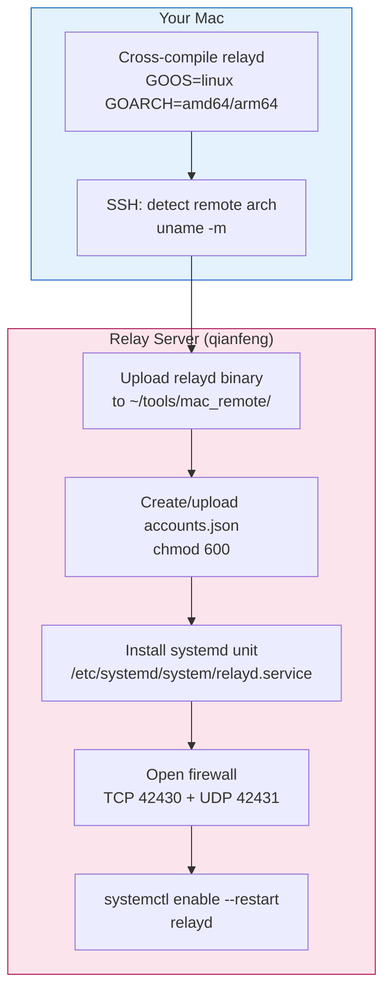
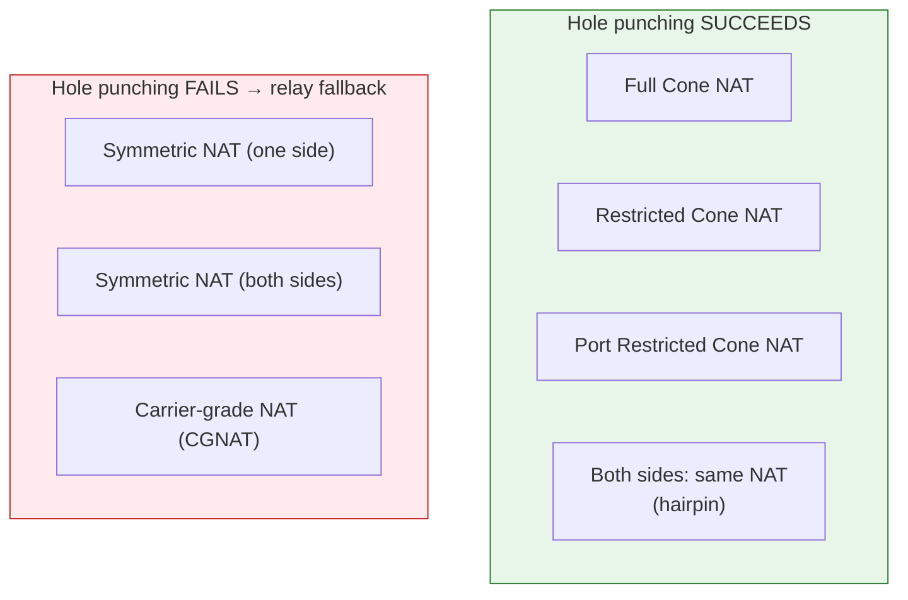

# Relay Server Deployment Guide

For current personal-use commands, security requirements, TCP fallback, and ports
4430/4431, use [DEPLOYMENT.md](DEPLOYMENT.md). The deployment examples and legacy
hole-punch sequence below predate the current request/response route probes.
Always quote a remote home path: `scripts/deploy_relay.sh myserver '~/relay'`.

This document covers deploying the `relayd` server to a remote host, managing accounts, and the NAT hole punching feature that enables direct P2P connections when possible.

---

## Table of Contents

- [Quick Start: deploy_relay.sh](#quick-start-deploy_relaysh)
- [Architecture Overview](#architecture-overview)
- [NAT Hole Punching](#nat-hole-punching)
- [Manual Deployment](#manual-deployment)
- [Account Management](#account-management)
- [Service Management](#service-management)
- [Troubleshooting](#troubleshooting)

---

## Quick Start: deploy_relay.sh

The `scripts/deploy_relay.sh` script automates the entire deployment: cross-compile for Linux, upload via SSH, install systemd service, open firewall, and restart.

### Prerequisites

- Go 1.21+ installed locally (for cross-compilation)
- SSH access to the relay server (key-based auth recommended)
- `sudo` access on the relay server (for systemd + firewall)

### Basic usage

```sh
# Deploy to default host (qianfeng) at ~/tools/mac_remote
scripts/deploy_relay.sh

# Deploy to a custom host and directory
scripts/deploy_relay.sh myserver ~/relay

# Custom ports
scripts/deploy_relay.sh qianfeng ~/tools/mac_remote --control-port 4430 --udp-port 4431
```

### What the script does



### First run: account setup

On first deploy (when `accounts.json` doesn't exist on the server), the script interactively prompts:

```
    Host device-id (e.g. office-mac): office-mac
    Host password: ********
    Viewer username (e.g. alice): alice
    Viewer password: ********
```

On subsequent deploys, the existing `accounts.json` is preserved. To update accounts, use `--accounts /path/to/local/accounts.json` to upload a new one.

### All flags

| Flag | Default | Description |
|------|---------|-------------|
| `--control-port N` | 42430 | TCP control port |
| `--udp-port N` | 42431 | UDP data port |
| `--arch ARCH` | both | Target architecture (amd64, arm64, both) |
| `--accounts FILE` | — | Local accounts.json to upload (skip interactive prompt) |
| `--no-restart` | — | Don't restart service after deploy |

### After deployment

The script prints the relay address and usage:

```
==> Deploy complete!
    Server:  qianfeng
    Relay address: <public-ip>:42430

    Host:    mac_remote_host --relay <addr>:42430 --device-id office-mac
    Client:  mac_remote_client --relay <addr>:42430 --user alice --device-id office-mac
```

---

## Architecture Overview

```mermaid
graph TB
    subgraph NetA["Intranet A (e.g. office)"]
        H["Host Mac<br/>mac_remote_host<br/>--relay R:42430<br/>--device-id office-mac"]
    end

    subgraph Cloud["Relay Server (qianfeng)"]
        R["relayd<br/>TCP :42430 control<br/>UDP :42431 data<br/>accounts.json"]
    end

    subgraph NetB["Intranet B (e.g. home)"]
        C["Client Mac<br/>mac_remote_client<br/>--relay R:42430<br/>--user alice<br/>--device-id office-mac"]
    end

    H -->|outbound TCP+UDP| R
    C -->|outbound TCP+UDP| R

    R -.->|RPEP: peer endpoint| H
    R -.->|RPEP: peer endpoint| C

    H -.->|PUNCH (direct)| C
    C -.->|PUNCH (direct)| H

    style NetA fill:#fff3e0,stroke:#e65100
    style Cloud fill:#fce4ec,stroke:#ad1457
    style NetB fill:#e3f2fd,stroke:#1565c0
```

---

## NAT Hole Punching

When both Macs are behind NAT, the relay normally forwards all traffic. **Hole punching** attempts to establish a **direct P2P UDP connection** between the two Macs, bypassing the relay for data. This reduces latency and server bandwidth.

### How it works

```mermaid
sequenceDiagram
    participant H as Host Mac
    participant R as relayd
    participant C as Client Mac

    Note over H,R,C: Normal relay setup (auth, session, bind) already done

    rect rgb(255, 243, 224)
        Note over R: Both sides have bound UDP
        R->>H: RPEP [client's public IP:port]
        R->>C: RPEP [host's public IP:port]
        Note over H,C: Now each side knows the other's public endpoint
    end

    rect rgb(227, 242, 253)
        Note over H,C: Hole punching phase (3s timeout)
        loop Every 200ms (up to 15 times)
            H->>C: PUNCH (direct UDP, not via relay)
            C->>H: PUNCH (direct UDP, not via relay)
        end
    end

    alt PUNCH received (NAT allows direct)
        Note over H,C: Switch to DIRECT MODE
        H->>C: Video/input data (direct UDP)
        C->>H: Input data (direct UDP)
        Note over R: Relay no longer forwards data<br/>(control channel stays alive)
    else No PUNCH received (symmetric NAT)
        Note over H,C: Stay on RELAY MODE
        H->>R: Data via relay
        R->>C: Forwarded data
    end
```

### NAT type compatibility



| NAT Type | Hole Punch | Effective Path |
|----------|-----------|----------------|
| Full Cone | ✅ Direct | P2P (lowest latency) |
| Restricted Cone | ✅ Direct | P2P (lowest latency) |
| Port Restricted Cone | ✅ Direct | P2P (lowest latency) |
| Symmetric (one side) | ❌ Fails | Relay (fallback) |
| Symmetric (both sides) | ❌ Fails | Relay (fallback) |
| CGNAT (carrier) | ❌ Fails | Relay (fallback) |

Most home routers use Full/Restricted Cone NAT, so **hole punching typically succeeds** for home-to-home connections. Corporate networks with Symmetric NAT fall back to relay automatically.

### Protocol details

**RPEP message** (relay → peer, via UDP data channel):
```
"RPEP" (4B) + [u8 ipLen] [IP string] [u16 port LE]
```
Sent by relayd after both sides bind. Tells each side the other's public endpoint (as seen by the relay).

**PUNCH message** (peer → peer, direct UDP):
```
"PUNCH" (5B) + [u64 sessionId LE]
```
Sent directly between peers (not through relay). If received, the sender's NAT allows incoming from the receiver's endpoint → direct mode is safe.

**Mode switching:**
- **Relay mode**: data sent to `relayHost:relayUdpPort`, relay forwards to peer
- **Direct mode**: data sent directly to `peerHost:peerPort`, bypassing relay
- Switch is one-way (relay → direct); never falls back to relay after going direct
- TCP control channel stays alive in both modes (for keepalive, session teardown)

### Same socket for relay + direct

The Swift `RawUDPSocket` uses a single BSD UDP socket for both relay and direct communication. This is critical: the NAT mapping created when sending to the relay is the same mapping the peer uses to send PUNCH packets back. Using separate sockets would create different NAT mappings and hole punching would fail.

---

## Manual Deployment

If you prefer not to use the deploy script:

### 1. Cross-compile relayd

```sh
cd relayd
GOOS=linux GOARCH=amd64 CGO_ENABLED=0 go build -o relayd-linux-amd64 .
# For ARM64 servers:
GOOS=linux GOARCH=arm64 CGO_ENABLED=0 go build -o relayd-linux-arm64 .
```

### 2. Upload to server

```sh
scp relayd-linux-amd64 qianfeng:~/tools/mac_remote/relayd
ssh qianfeng "chmod +x ~/tools/mac_remote/relayd"
```

### 3. Create accounts.json

```sh
ssh qianfeng 'cat > ~/tools/mac_remote/accounts.json' << 'EOF'
{
  "users": { "alice": "alice-password" },
  "hosts": { "office-mac": "host-password" }
}
EOF
ssh qianfeng "chmod 600 ~/tools/mac_remote/accounts.json"
```

### 4. Install systemd service

```sh
ssh qianfeng 'sudo tee /etc/systemd/system/relayd.service' << 'EOF'
[Unit]
Description=mac_remote relay server
After=network.target

[Service]
ExecStart=%h/tools/mac_remote/relayd -control 42430 -udp 42431 -config %h/tools/mac_remote/accounts.json
Restart=always
RestartSec=3
WorkingDirectory=%h/tools/mac_remote

[Install]
WantedBy=multi-user.target
EOF

ssh qianfeng "sudo systemctl daemon-reload && sudo systemctl enable --now relayd"
```

### 5. Open firewall

```sh
ssh qianfeng "sudo ufw allow 42430/tcp && sudo ufw allow 42431/udp"
```

---

## Account Management

### accounts.json format

```json
{
  "users": {
    "alice": "alice-password",
    "bob": "bob-password"
  },
  "hosts": {
    "office-mac": "office-host-password",
    "home-mac": "home-host-password"
  }
}
```

- `users` — viewer accounts (client Macs log in with `--user`)
- `hosts` — device accounts (host Macs register with `--device-id`)

### Adding a new user

```sh
ssh qianfeng 'cat ~/tools/mac_remote/accounts.json'
# Edit locally, then upload:
scp accounts.json qianfeng:~/tools/mac_remote/accounts.json
ssh qianfeng "sudo systemctl restart relayd"
```

### Password hashing

To avoid storing plaintext passwords, use the `-hash` helper:

```sh
ssh qianfeng '~/tools/mac_remote/relayd -hash "my-password"'
# Output: a1b2c3d4e5f6...
```

Put the hex hash in `accounts.json` instead of the plaintext password. The `authKey()` function applies SHA256 to the value in the file, so storing `SHA256(password)` means the effective key is `SHA256(SHA256(password))`.

---

## Service Management

### Common commands

```sh
# Status
ssh qianfeng "sudo systemctl status relayd"

# Restart
ssh qianfeng "sudo systemctl restart relayd"

# Stop
ssh qianfeng "sudo systemctl stop relayd"

# View logs (real-time)
ssh qianfeng "sudo journalctl -u relayd -f"

# View recent logs
ssh qianfeng "sudo journalctl -u relayd --since '5 min ago' --no-pager"
```

### Expected log output

```
accounts loaded: 1 users, 1 host devices
relayd listening: control tcp/:42430, data udp/:42431
host device registered: office-mac (1.2.3.4:54321)
viewer logged in: alice (5.6.7.8:12345)
session 1234567890 opened: alice -> office-mac
session 1234567890: bound host endpoint 1.2.3.4:54322
session 1234567890: bound client endpoint 5.6.7.8:12346
session 1234567890: sent peer endpoints for hole punching
```

The last line indicates hole punching was initiated. If the peers successfully punch through, they switch to direct mode (relayd stops seeing data traffic for that session).

---

## Troubleshooting

### Deploy script fails

| Issue | Fix |
|-------|-----|
| `go: command not found` | Install Go 1.21+ locally |
| SSH connection refused | Verify `ssh qianfeng` works; check SSH config |
| `sudo: a password is required` | Ensure passwordless sudo or run interactively |
| `Bootstrap failed: 5` | Service already loaded — use `systemctl restart` instead |

### Relay starts but clients can't connect

| Issue | Check |
|-------|-------|
| TCP port blocked | `nc -zv <server-ip> 42430` from client Mac |
| UDP port blocked | `echo test \| nc -u -w1 <server-ip> 42431` |
| Firewall (cloud provider) | Check AWS/GCP/Azure security groups |
| Wrong relay address | Use public IP, not private: `ssh qianfeng 'curl -s ifconfig.me'` |

### Hole punching doesn't work

| Issue | Check |
|-------|-------|
| Logs show "staying on relay" | Symmetric NAT — relay fallback is expected |
| No "sent peer endpoints" log | Both sides didn't bind — check UDP connectivity |
| "hole punch success" but no data | Check direct UDP between peers (firewall may block) |

Hole punching failing is **not an error** — the relay fallback works correctly. Direct mode is an optimization, not a requirement.

### Verify hole punching status

On the host or client Mac, run with `--debug`:

```sh
mac_remote_host --relay <addr>:42430 --device-id office-mac --debug
```

Look for:
- `peer endpoint: 5.6.7.8:12345 — starting hole punch` — RPEP received
- `hole punch success — switched to direct mode` — P2P established
- `hole punch failed — staying on relay` — fallback (still works, just via relay)