# Relay Mode: Bridging Two Intranets via a Cloud Server

When the client and host Macs are on different networks (both behind NAT), direct UDP is impossible. Relay mode routes both sides through your own cloud server (`relayd`), so **both intranets are bridged with outbound-only connections** — no port forwarding, no router changes, no inbound NAT holes.

This document covers the architecture, protocol, deployment, configuration, security model, and troubleshooting for relay mode.

---

## Table of Contents

- [Overview](#overview)
- [Architecture](#architecture)
- [Connection Lifecycle](#connection-lifecycle)
- [Data Flow](#data-flow)
- [Protocol Reference](#protocol-reference)
- [Server Deployment](#server-deployment)
- [Host Mac Configuration](#host-mac-configuration)
- [Client Mac Configuration](#client-mac-configuration)
- [Security Model](#security-model)
- [Monitoring & Troubleshooting](#monitoring--troubleshooting)
- [Capacity Planning](#capacity-planning)

---

## Overview

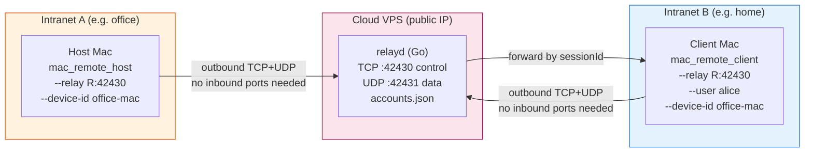

**Key properties:**

| Property | Detail |
|----------|--------|
| Connection direction | Both sides → relay (outbound only) |
| NAT traversal | Works behind any NAT (CGNAT, carrier-grade, symmetric) — no STUN/TURN needed |
| Authentication | HMAC-SHA256 challenge-response (password never sent) |
| Accounts | Server-side only (`accounts.json`), no registration API |
| Sessions | One session per client connect; random 64-bit session ID |
| Data path | UDP datagrams forwarded verbatim between session endpoints |
| Encryption | Auth is cryptographic; data is NOT e2e encrypted (wrap in WireGuard if needed) |
| Viewers | One viewer per host at a time (new connect replaces old) |

---

## Architecture

### Component Diagram

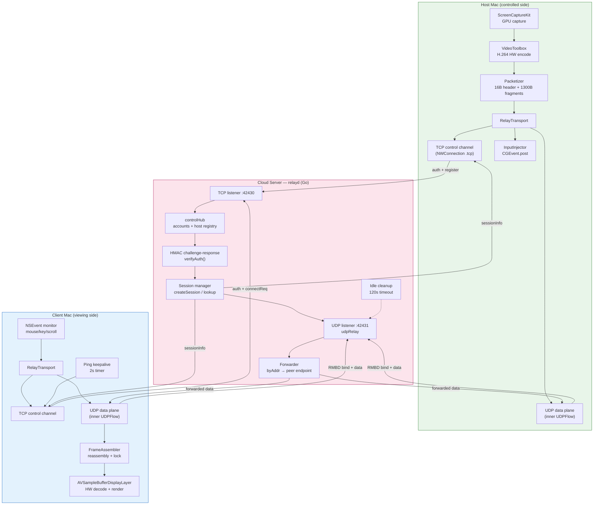

### Why two channels (TCP control + UDP data)?

```mermaid
graph LR
    subgraph Control["TCP Control Channel (:42430)"]
        direction TB
        C1["HMAC challenge-response auth"]
        C2["Host device registration"]
        C3["Client login + connectReq"]
        C4["Session creation + info delivery"]
        C5["ping/pong keepalive (10s)"]
    end

    subgraph Data["UDP Data Channel (:42431)"]
        direction TB
        D1["RMBD bind frame (sessionId + side)"]
        D2["Video packets (fragmented)"]
        D3["Input packets (mouse/key/scroll)"]
        D4["Control packets (hello, keyframe, switchDisplay)"]
        D5["ping/pong keepalive (2s, inside Transport)"]
    end

    Control -->|sessionInfo:<br/>sessionId + udpPort| Data

    style Control fill:#fff3e0,stroke:#e65100
    style Data fill:#e3f2fd,stroke:#1565c0
```

- **TCP control** — reliable, ordered: auth handshake, session setup, host registry. Small volume, infrequent.
- **UDP data** — low-latency, loss-tolerant: video frames, input events. High volume, real-time. The existing mac_remote packet protocol flows unchanged inside UDP datagrams, forwarded verbatim by the relay.

---

## Connection Lifecycle

The full connection has 5 phases. Both sides make only **outbound** connections.

```mermaid
sequenceDiagram
    autonumber
    participant H as Host Mac<br/>(RelayTransport)
    participant R as relayd<br/>(controlHub + udpRelay)
    participant C as Client Mac<br/>(RelayTransport)

    Note over H: Started with --device-id office-mac
    Note over C: Started with --user alice --device-id office-mac
    Note over R: relayd running, accounts.json loaded

    rect rgb(255, 243, 224)
        Note over H,R: Phase 1 — Host registers (on startup)
        H->>R: TCP connect to :42430
        R->>H: challenge (32-byte random nonce)
        H->>H: key = SHA256(password)<br/>mac = HMAC-SHA256(key, nonce)
        H->>R: authHost [device-id="office-mac", 32B HMAC]
        R->>R: verifyAuth against accounts.hosts["office-mac"]
        R->>H: ok
        R->>R: registerHost("office-mac", conn)
        Note over R: Log: "host device registered: office-mac"
    end

    rect rgb(227, 242, 253)
        Note over C,R: Phase 2 — Client logs in + requests device
        C->>R: TCP connect to :42430
        R->>C: challenge (32-byte random nonce)
        C->>C: key = SHA256(password)<br/>mac = HMAC-SHA256(key, nonce)
        C->>R: authUser [username="alice", 32B HMAC]
        R->>R: verifyAuth against accounts.users["alice"]
        R->>C: ok
        Note over R: Log: "viewer logged in: alice"
        C->>R: connectReq [device-id="office-mac"]
    end

    rect rgb(252, 228, 236)
        Note over H,R,C: Phase 3 — Session setup
        R->>R: lookupHost("office-mac") → found
        R->>R: sessionID = random 64-bit<br/>createSession(sessionID)
        R->>C: sessionInfo [sessionID, udpPort=42431]
        R->>H: sessionInfo [sessionID, udpPort=42431]
        Note over R: Log: "session 1234567890 opened: alice -> office-mac"
    end

    rect rgb(232, 245, 233)
        Note over H,R,C: Phase 4 — UDP bind (both sides)
        H->>R: UDP to :42431: RMBD + sessionID + side=1(host)
        R->>R: session.host = addr<br/>byAddr[addr] = session
        C->>R: UDP to :42431: RMBD + sessionID + side=2(client)
        R->>R: session.client = addr<br/>byAddr[addr] = session
        Note over R: Both endpoints recorded
    end

    rect rgb(243, 229, 245)
        Note over H,R,C: Phase 5 — Data relay (steady state)
        loop Video stream (60fps)
            H->>R: UDP: video fragments (16B header + payload)
            R->>R: lookup byAddr[src] → session<br/>dst = session.client
            R->>C: UDP: forward verbatim
        end
        loop Input events
            C->>R: UDP: input packets
            R->>R: lookup byAddr[src] → session<br/>dst = session.host
            R->>H: UDP: forward verbatim
            H->>H: InputInjector → CGEvent.post
        end
        loop Control keepalive (10s, TCP)
            H->>R: TCP: ping
            R->>H: TCP: pong
            C->>R: TCP: ping
            R->>C: TCP: pong
        end
        loop App keepalive (2s, UDP inside Transport)
            C->>R: UDP: ping control packet
            R->>H: UDP: forward
            H->>R: UDP: pong
            R->>C: UDP: forward
        end
    end
```

### RelayTransport State Machine (client/host side)

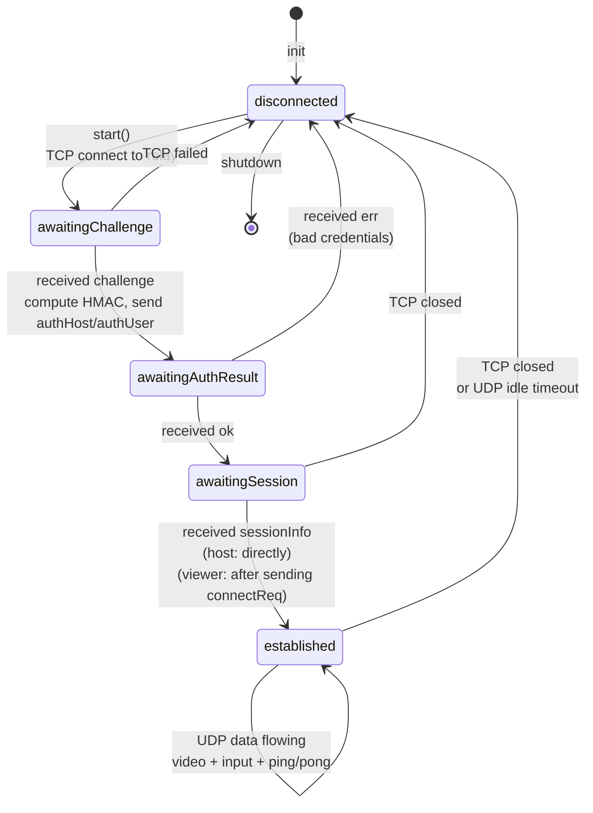

> **Note:** The host goes from `awaitingAuthResult` → `ok` → `established` directly (no `connectReq` — it doesn't request a device, it IS the device). Only the viewer sends `connectReq` after `ok`, entering `awaitingSession` until `sessionInfo` arrives.

### relayd Session Lifecycle

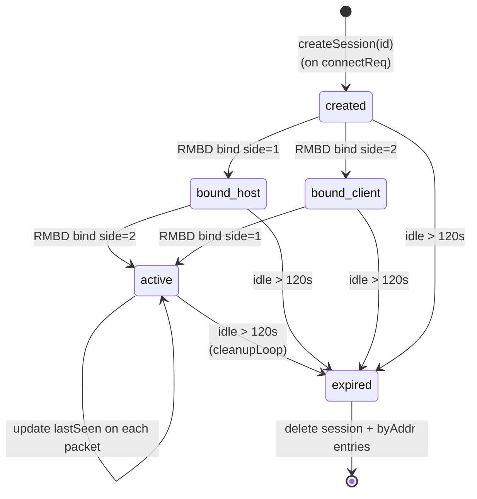

---

## Data Flow

### Video + Input Data Flow (steady state)

```mermaid
flowchart LR
    subgraph Host["Host Mac"]
        direction TB
        A1["ScreenCaptureKit<br/>60fps GPU capture"] -->|IOSurface zero-copy| A2["VideoToolbox<br/>H.264 HW encode"]
        A2 -->|NALUs| A3["Packetizer<br/>16B header + 1300B frags"]
        A3 --> A4["RelayTransport.send()"]
        A4 --> A5["UDPFlow.sendDatagram()"]
    end

    subgraph Relay["relayd"]
        direction TB
        B1["UDP ReadFromUDP"] --> B2{"RMBD magic?"}
        B2 -->|yes| B3["Record endpoint<br/>session.host/client = addr"]
        B2 -->|no| B4["byAddr[addr] → session"]
        B4 --> B5{"src == host?"}
        B5 -->|yes| B6["dst = session.client"]
        B5 -->|no| B7["dst = session.host"]
        B6 --> B8["WriteToUDP(dst)"]
        B7 --> B8
    end

    subgraph Client["Client Mac"]
        direction TB
        C1["UDPFlow.onPacket"] --> C2["RelayTransport.onPacket"]
        C2 --> C3["FrameAssembler<br/>reassemble by frameId"]
        C3 --> C4{"Complete frame?"}
        C4 -->|yes| C5["AVSampleBufferDisplayLayer<br/>enqueue + HW decode"]
        C4 -->|no| C3
    end

    A5 -->|UDP datagram| B1
    B8 -->|UDP datagram| C1

    style Host fill:#e8f5e9,stroke:#2e7d32
    style Relay fill:#fce4ec,stroke:#ad1457
    style Client fill:#e3f2fd,stroke:#1565c0
```

### Input Event Flow (client → host)

```mermaid
flowchart LR
    subgraph Client["Client Mac"]
        direction TB
        D1["NSEvent local monitor<br/>(mouseDown/keyDown/scroll)"] --> D2["InputSender<br/>normalizedPoint 0.0-1.0"]
        D2 --> D3["InputPacket 28B"]
        D3 --> D4["RelayTransport.sendControl()"]
        D4 --> D5["UDPFlow → relay"]
    end

    subgraph Relay["relayd"]
        E1["Forward by session"] --> E2["WriteToUDP(host endpoint)"]
    end

    subgraph Host["Host Mac"]
        direction TB
        F1["UDPFlow.onPacket"] --> F2["Parse InputPacket"]
        F2 --> F3["Map normalized → global CG coords<br/>(display origin offset)"]
        F3 --> F4["InputInjector<br/>CGEvent.post(tap: .cghidEventTap)"]
    end

    D5 --> E1
    E2 --> F1

    style Client fill:#e3f2fd,stroke:#1565c0
    style Relay fill:#fce4ec,stroke:#ad1457
    style Host fill:#e8f5e9,stroke:#2e7d32
```

### Packet Structure Inside UDP Datagrams

The relay forwards UDP datagrams **verbatim** — it does not parse or modify the mac_remote packet protocol. The existing protocol flows unchanged:

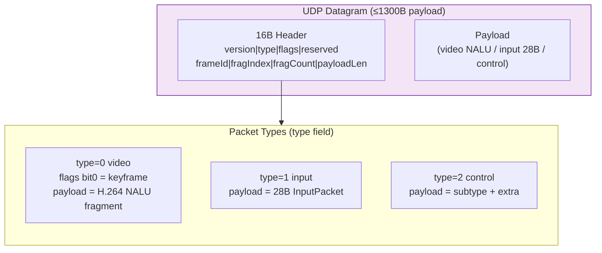

---

## Protocol Reference

### TCP Control Channel Frame Format

Every control frame is:

```
[u16 type LE] [u32 payloadLen LE] [payload...]
```

Total header: 6 bytes. Max payload: 1 MiB (`maxFrameSize = 1 << 20`).

### Control Frame Types

| Type | Name | Direction | Payload Format | Description |
|------|------|-----------|----------------|-------------|
| 1 | `challenge` | S→C | 32-byte nonce | Server sends on TCP connect |
| 2 | `authHost` | C→S | `[u8 idLen][device-id UTF-8][32B HMAC]` | Host authenticates + registers |
| 3 | `authUser` | C→S | `[u8 nameLen][username UTF-8][32B HMAC]` | Viewer authenticates |
| 4 | `ok` | S→C | — (empty) | Auth succeeded |
| 5 | `err` | S→C | `[u8 len][message UTF-8]` | Error (bad credentials, device offline, etc.) |
| 6 | `connectReq` | C→S | `[u8 len][device-id UTF-8]` | Viewer requests to connect to a device |
| 7 | `sessionInfo` | S→C | `[u64 sessionId LE][u16 udpPort LE]` | Session created, sent to both host and viewer |
| 8 | `ping` | both | — (empty) | Keepalive |
| 9 | `pong` | both | — (empty) | Keepalive response |

### HMAC Authentication Detail

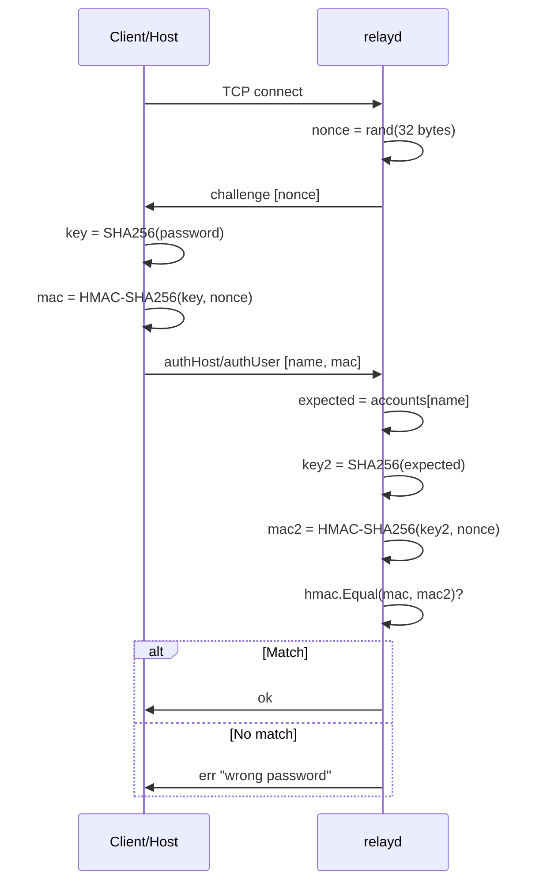

**Why this scheme:**
- Password never crosses the wire (only the HMAC)
- Replay defeated by per-connection random nonce
- `hmac.Equal` uses constant-time comparison (no timing side-channel)
- Key = `SHA256(password)` adds a preimage step (accounts.json can store hashes instead of plaintext)

### UDP Data Channel Bind Frame

The first UDP datagram from each side is a **bind frame**:

```
[4B magic "RMBD"] [8B sessionId LE] [1B side]
```

| side | Meaning |
|------|---------|
| 1 | host endpoint |
| 2 | client endpoint |

After bind, all subsequent datagrams from that source address are forwarded to the session's other endpoint. The relay identifies sessions by source address (`byAddr` map), not by parsing each datagram.

### relayd Timeouts

| Timeout | Value | Purpose |
|---------|-------|---------|
| `authTimeout` | 15s | Max time to complete auth after TCP connect |
| `idleTimeout` | 120s | UDP session idle cleanup (no packets for 2 min → session expired) |
| Control read deadline | 120s | Reset on each frame; TCP connection dropped if idle |
| Control ping (Swift side) | 10s | RelayTransport sends TCP ping every 10s |
| App keepalive (Swift side) | 2s | Streamer sends UDP ping every 2s (inside Transport) |

---

## Server Deployment

### Deployment Diagram

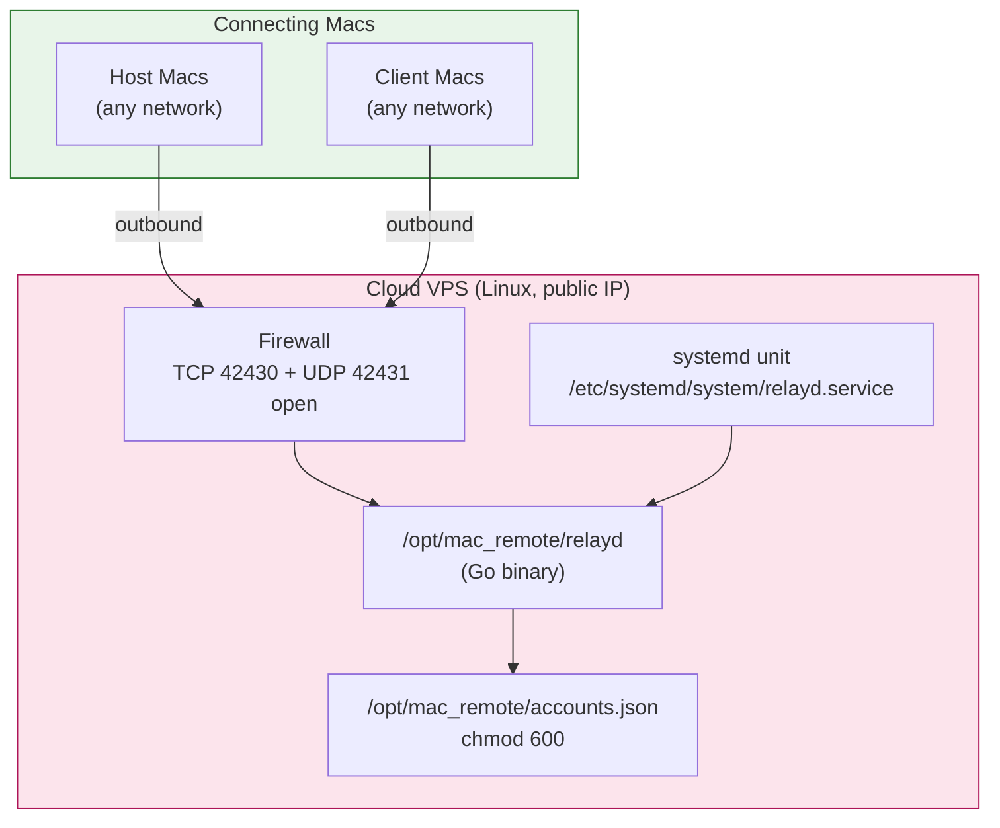

### Requirements

- Any Linux VPS with a **public IP address**
- Go 1.21+ (for building; the binary is statically linked, no runtime dependency)
- Inbound firewall: **TCP 42430** + **UDP 42431**
- ~256 MB RAM minimum (relayd is lightweight; memory scales with active sessions)

### Step 1: Build relayd

On the VPS (or cross-compile anywhere with Go):

```sh
git clone https://github.com/klab-mao/mac_remote.git
cd mac_remote/relayd
go build -o relayd .
```

The resulting `relayd` binary is statically linked — copy it to any Linux server.

### Step 2: Create accounts.json

```json
{
  "users": {
    "alice": "alice-strong-password",
    "bob": "bob-strong-password",
    "carol": "carol-strong-password"
  },
  "hosts": {
    "office-mac": "office-host-password",
    "home-mac": "home-host-password",
    "lab-imac": "lab-host-password"
  }
}
```

- `users` — accounts for **client** Macs (viewers who log in with `--user`)
- `hosts` — accounts for **host** Macs (controlled devices, keyed by `--device-id`)

```sh
chmod 600 accounts.json
```

**Storing hashes instead of plaintext:** Use the `-hash` helper to precompute:

```sh
./relayd -hash "alice-strong-password"
# outputs: a1b2c3d4... (sha256 hex)
```

Put the hex string in `accounts.json` instead of the plaintext password. The `authKey()` function applies SHA256 to whatever is in the file, so storing `SHA256(password)` means the effective key becomes `SHA256(SHA256(password))` — adjust your client `--password` accordingly, or just use plaintext for simplicity (the file is `chmod 600` and server-side only).

### Step 3: Install as a systemd service

```ini
# /etc/systemd/system/relayd.service
[Unit]
Description=mac_remote relay server
After=network.target

[Service]
ExecStart=/opt/mac_remote/relayd -control 42430 -udp 42431 -config /opt/mac_remote/accounts.json
Restart=always
RestartSec=3
User=nobody
AmbientCapabilities=CAP_NET_BIND_SERVICE

[Install]
WantedBy=multi-user.target
```

```sh
sudo mkdir -p /opt/mac_remote
sudo cp relayd /opt/mac_remote/
sudo cp accounts.json /opt/mac_remote/
sudo cp /etc/systemd/system/relayd.service .  # (or create as above)
sudo systemctl daemon-reload
sudo systemctl enable --now relayd
sudo systemctl status relayd
```

### Step 4: Open firewall

```sh
# ufw (Ubuntu/Debian):
sudo ufw allow 42430/tcp
sudo ufw allow 42431/udp

# iptables:
sudo iptables -A INPUT -p tcp --dport 42430 -j ACCEPT
sudo iptables -A INPUT -p udp --dport 42431 -j ACCEPT

# firewalld (RHEL/CentOS):
sudo firewall-cmd --permanent --add-port=42430/tcp
sudo firewall-cmd --permanent --add-port=42431/udp
sudo firewall-cmd --reload
```

Also open the ports in your **cloud provider's security group** (AWS Security Group, GCP Firewall, Azure NSG, etc.).

### Step 5: Verify

```sh
sudo journalctl -u relayd -f
# Should show:
# relayd listening: control tcp/:42430, data udp/:42431
# accounts loaded: 3 users, 3 host devices

ss -tlnp | grep 42430    # TCP control port listening
ss -ulnp | grep 42431    # UDP data port listening
```

### Flags Reference

| Flag | Default | Description |
|------|---------|-------------|
| `-control` | 42430 | TCP control port |
| `-udp` | 42431 | UDP data relay port |
| `-config` | accounts.json | Path to accounts JSON file |
| `-hash` | — | Print SHA256 auth key of a password and exit (helper) |

---

## Host Mac Configuration

### Command

```sh
.build/out/Products/Debug/mac_remote_host \
  --relay relay.example.com:42430 \
  --device-id office-mac \
  --password office-host-password
```

Or with environment variable (avoids password in `ps` output):

```sh
export MAC_REMOTE_PASSWORD="office-host-password"
.build/out/Products/Debug/mac_remote_host --relay relay.example.com:42430 --device-id office-mac
```

### All Host Flags (relay mode)

| Flag | Default | Description |
|------|---------|-------------|
| `--relay host:port` | — | Relay server address (enables relay mode) |
| `--device-id` | — | Device name registered on relay (required with `--relay`) |
| `--password` | — | Device account password (or `$MAC_REMOTE_PASSWORD`) |
| `--fps` | 60 | Capture/encode framerate |
| `--bitrate` | 25 | H.264 bitrate in Mbps |
| `--display` | 0 | Initial display index |
| `--client-timeout` | 10 | Seconds without client packets before pausing video |
| `--debug` | — | Verbose logging |

When `--relay` is given, the LAN UDP listener is **not** started. All LAN flags (`--fps`, `--bitrate`, `--display`, `--client-timeout`) still apply.

### As a launchd service

The `scripts/install_service.sh` helper supports relay mode. Pass the relay flags:

```sh
scripts/install_service.sh \
  --relay relay.example.com:42430 \
  --device-id office-mac
```

The password is read from `$MAC_REMOTE_PASSWORD` at service start time. Set it in the launchd plist or a wrapper script. See README for launchd details.

---

## Client Mac Configuration

### Command

```sh
.build/out/Products/Debug/mac_remote_client \
  --relay relay.example.com:42430 \
  --user alice \
  --device-id office-mac
```

Password is prompted with echo disabled:

```
Password: ********
```

Or non-interactive:

```sh
.build/out/Products/Debug/mac_remote_client \
  --relay relay.example.com:42430 \
  --user alice \
  --device-id office-mac \
  --password alice-strong-password
```

Or via environment:

```sh
export MAC_REMOTE_PASSWORD="alice-strong-password"
.build/out/Products/Debug/mac_remote_client --relay relay.example.com:42430 --user alice --device-id office-mac
```

### All Client Flags (relay mode)

| Flag | Default | Description |
|------|---------|-------------|
| `--relay host:port` | — | Relay server address (enables relay mode) |
| `--user` | — | Username to log in as (from accounts.json `users`) |
| `--device-id` | — | Device to connect to (from accounts.json `hosts`) |
| `--password` | — | User account password (or `$MAC_REMOTE_PASSWORD`, or prompted) |
| `--debug` | — | Verbose logging |

LAN mode still works without `--relay`: `mac_remote_client <host-ip> [--port 42420]`.

---

## Security Model

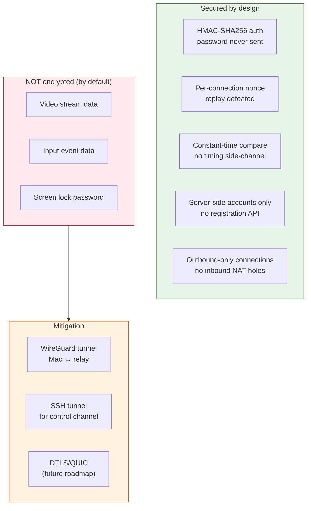

### What is secured

- **Authentication** — HMAC-SHA256 challenge-response. The password never crosses the wire. Each connection gets a fresh 32-byte nonce, so captured auth frames cannot be replayed.
- **Account management** — Accounts exist only in `accounts.json` on the server. There is no registration endpoint, no password reset API, no self-service. Access is controlled entirely by who has SSH access to the VPS.
- **Connection direction** — Both Macs connect outbound. No inbound ports need to be opened on either intranet's router. This works behind any NAT topology.

### What is NOT encrypted

- **Video/input data** — UDP datagrams forwarded verbatim by the relay. The video stream and input events cross the public internet between your intranets and the relay in cleartext.
- **Screen lock password** — The unlock password (sent via `unlockRequest` control packet) travels in cleartext inside the UDP data plane.

### Mitigations for sensitive use

1. **WireGuard** (recommended) — Run WireGuard between each Mac and the relay VPS. relayd then bridges inside the encrypted tunnel. Zero code changes; adds ~1ms overhead.

   ```sh
   # On each Mac + VPS: install WireGuard, configure peers
   # Then use the WireGuard interface IP as the relay address:
   mac_remote_host --relay 10.0.0.1:42430 --device-id office-mac
   ```

2. **SSH tunnel** — Tunnel the TCP control channel through SSH (`ssh -L 42430:localhost:42430 vps`). The UDP data plane would still need WireGuard or a UDP tunnel.

3. **DTLS/QUIC** — Future roadmap item: add end-to-end encryption to the data plane directly in the protocol.

### Operational security

- `chmod 600 accounts.json` — only the relayd user can read it
- SSH key-only access to the VPS (disable password auth)
- Use strong, unique passwords for each account
- Rotate passwords periodically
- Monitor relayd logs for auth failures
- Consider fail2ban for repeated auth failures on TCP 42430

---

## Monitoring & Troubleshooting

### Log Locations

| Component | Log location |
|-----------|-------------|
| relayd (systemd) | `sudo journalctl -u relayd -f` |
| relayd (manual) | stdout (use `stdbuf -oL` if redirecting to a file) |
| Host Mac | stdout, or `~/Library/Application Support/mac_remote/host.log` (launchd) |
| Client Mac | stdout |

### Expected Log Sequence

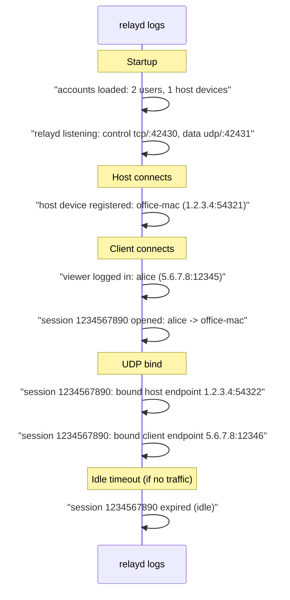

### Troubleshooting Table

| Symptom | Likely Cause | Check |
|---------|-------------|-------|
| Host can't connect to relay | Network/firewall | `nc -zv relay.example.com 42430` from host |
| Host: `relay rejected: unknown account` | device-id not in accounts.json `hosts` | Check `accounts.json` has the device-id |
| Host: `relay rejected: wrong password` | Password mismatch | Compare `--password` with `accounts.json` |
| Client: `relay rejected: unknown account` | username not in accounts.json `users` | Check `accounts.json` has the username |
| Client: `relay rejected: device offline: office-mac` | Host not registered | Check relayd log for `host device registered` |
| Session created but no video | UDP blocked or bind failed | Check firewall allows UDP 42431; check relayd log for `bound` messages |
| Video stuttering / freezing | VPS bandwidth or location | Check VPS network speed; choose geographically closer VPS |
| relayd log empty when redirected | stdout block-buffering | Use `journalctl -u relayd -f` or `stdbuf -oL ./relayd ...` |
| Session expires after 2 min | Idle timeout (no traffic) | Ensure client is actively viewing; check 2s ping timer |
| High latency | VPS location / network path | Choose central VPS; consider WireGuard to reduce overhead |

### Diagnostic Commands

```sh
# Check relayd is running and listening:
sudo systemctl status relayd
ss -tlnp | grep 42430
ss -ulnp | grep 42431

# Watch relayd logs in real-time:
sudo journalctl -u relayd -f --since "1 min ago"

# Test TCP connectivity from a Mac:
nc -zv relay.example.com 42430

# Test UDP connectivity (send a test datagram):
echo -n "test" | nc -u -w1 relay.example.com 42431

# Check active sessions (relayd doesn't have an admin API;
# read from logs):
sudo journalctl -u relayd --since "5 min ago" | grep "session"
```

### Host-side diagnostics

Run the host with `--debug` for verbose logging:

```sh
mac_remote_host --relay relay.example.com:42430 --device-id office-mac --debug
```

Expected output:
```
relay control connected
relay session 1234567890 ready (udp 42431)
relay data: connected
Encoder ready: 2560x1440 25Mbps H.264 HW
encoded #1: 307157 bytes, keyframe=true, frags=237
```

### Client-side diagnostics

```sh
mac_remote_client --relay relay.example.com:42430 --user alice --device-id office-mac --debug
```

Expected output:
```
Password: ********
relay control connected
relay session 1234567890 ready (udp 42431)
relay data: connected
Format ready: 2560x1440
fps: 60
```

---

## Capacity Planning

### Bandwidth

The relay forwards all UDP traffic verbatim. Bandwidth consumption on the VPS:

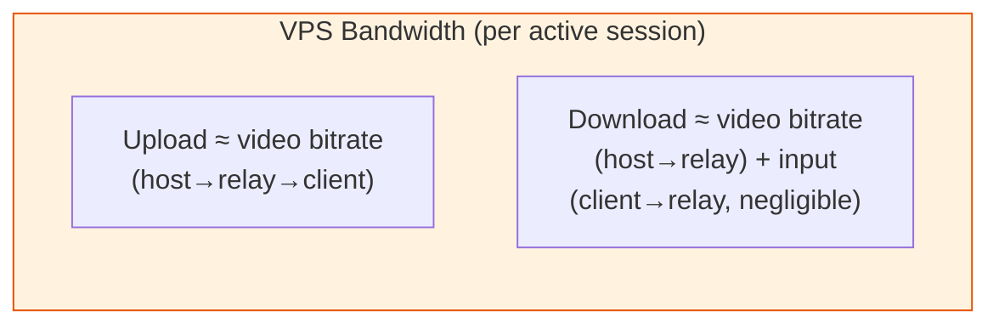

| `--bitrate` setting | Video bandwidth | VPS bandwidth (per session) |
|---------------------|-----------------|----------------------------|
| 25 Mbps (default) | ~3.1 MB/s | ~3.1 MB/s upload + ~3.1 MB/s download |
| 40 Mbps (high quality) | ~5 MB/s | ~5 MB/s each direction |
| 80 Mbps (near-lossless) | ~10 MB/s | ~10 MB/s each direction |

**Example:** A $5/mo VPS with 1 Gbps port can handle ~20 concurrent sessions at 40 Mbps (limited by port bandwidth, not CPU). CPU usage is minimal — relayd just forwards datagrams.

### Memory

~1 KB per session (session struct + address maps). 1000 sessions ≈ 1 MB. Negligible.

### CPU

relayd is I/O-bound, not CPU-bound. A single CPU core handles hundreds of sessions. The bottleneck is always network bandwidth, never CPU.

### Choosing a VPS

| Factor | Recommendation |
|--------|---------------|
| Location | Geographically between your Macs (minimizes RTT) |
| Bandwidth | ≥ 2× your `--bitrate` setting (for upload + download) |
| RAM | 256 MB minimum (relayd is lightweight) |
| CPU | 1 vCPU sufficient for <50 sessions |
| Provider | Any (AWS Lightsail, DigitalOcean, Hetzner, Vultr, etc.) |

For two Macs in the same country, a $5/mo VPS is typically sufficient. For cross-continental relay, choose a VPS in a geographically central location (e.g., Tokyo for JP↔US, Frankfurt for EU↔US).